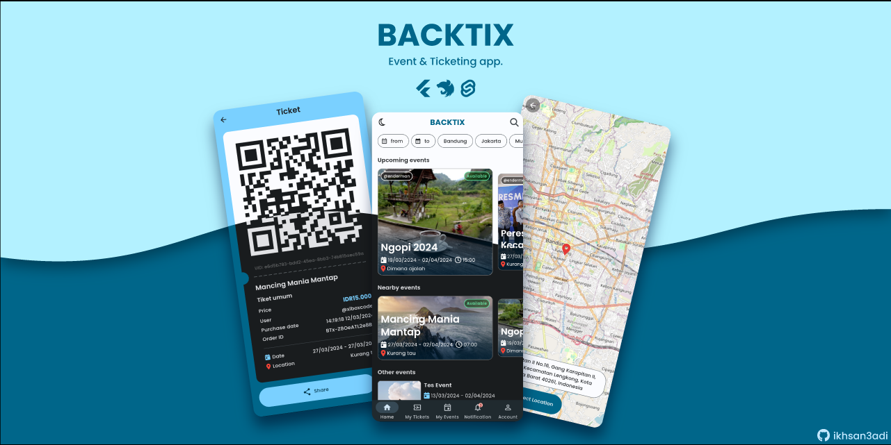

# باكتيكس

> تطبيق مفتوح المصدر للفعاليات وحجز التذاكر

* * *

يعد تطبيق إنشاء الأحداث وبيع التذاكر عبر الإنترنت بمثابة منصة تسهل على المستخدمين الوصول إلى الأحداث المختلفة والمشاركة فيها. وفيما يلي الوصف
باختصار الملامح الرئيسية للتطبيق:

-   المصادقة:

    يوفر التطبيق مصادقة آمنة عبر JSON Web Token (JWT) وتسجيل الدخول بحساب Google. يمكن للمستخدمين تسجيل الدخول بسهولة إلى حساباتهم باستخدام طرق مصادقة مريحة وآمنة.

-   تفعيل الحساب عبر البريد الإلكتروني:

    لزيادة الأمان وضمان أصالة المستخدم، يتطلب التطبيق تفعيل الحساب عبر البريد الإلكتروني. سيتلقى المستخدمون رمز التفعيل لتأكيد حساباتهم وتفعيلها.

-   البحث عن الأحداث القريبة:

    يمكن للمستخدمين البحث عن الأحداث التي تجري بالقرب من موقعهم. تتيح هذه الميزة للمستخدمين اكتشاف الأحداث المنظمة حولهم والمشاركة فيها.

-   شراء التذاكر مع Midtrans:

    يوفر هذا التطبيق خدمات بيع التذاكر عبر الإنترنت باستخدام بوابة الدفع Midtrans. يمكن للمستخدمين بسهولة شراء التذاكر للأحداث ذات الاهتمام من خلال مجموعة متنوعة من خيارات الدفع المريحة.

-   إنشاء حدث بموافقة المسؤول:

    يمكن للمستخدمين الذين يريدون عقد الأحداث إنشائها من خلال التطبيق. ومع ذلك، سيتم نشر الحدث بعد الحصول على موافقة المشرف. وذلك لضمان جودة وأهمية الأحداث المعروضة على المنصة.

-   مسح رمز الاستجابة السريعة ضوئيًا لمنشئ الحدث:

    تسمح هذه الميزة لمنشئي الأحداث بالتحقق بسهولة من حضور الزائرين عن طريق مسح رمز الاستجابة السريعة الموجود على التذكرة. وهذا يساعد في إدارة الأحداث بكفاءة والتحقق من صحة التذاكر.

-   سحب الرصيد والدخل:

    يمكن لمنشئي الأحداث سحب رصيدهم وأرباحهم عبر ميزة السحب التي يوفرها التطبيق. وهذا يمنح منظمي الأحداث المرونة اللازمة لإدارة نتائجهم المالية بسهولة.

-   الإخطارات في الوقت الحقيقي

    بمساعدة_خدمة الخلفية_(Android وIOS)، سيتلقى المستخدمون إشعارات في الوقت الفعلي حول حالة الحدث وحالة السحب ومشتريات التذاكر ومبيعاتها.

## مكدس التكنولوجيا

-   خدمة API/الخلفية

    -   [نيست جي إس 10](https://nestjs.com/)تايب سكريبت
    -   بريزما ORM
    -   PostgreSQL
    -   ريديس
    -   اختيال (مستندات API)

-   ويب لوحة الإدارة (Monorepo مع خدمة API)

    -   [سفيلت كيت 2](https://kit.svelte.dev/)تايب سكريبت
    -   مكون واجهة المستخدم Flowbite
    -   الريح الخلفية CSS

-   تطبيق الجوال

    -   [الرفرفة 3](https://flutter.dev/)
        -   كتلة
        -   مجمدة
        -   التحديثية
        -   com.fpdart

## مصدر الرمز

## تثبيت &_كيف تركض_

[خدمة API الخلفية](docs/api-service.md)

[لوحة الادارة](docs/admin-panel.md)

[تطبيق الجوال](docs/mobile-app.md)
