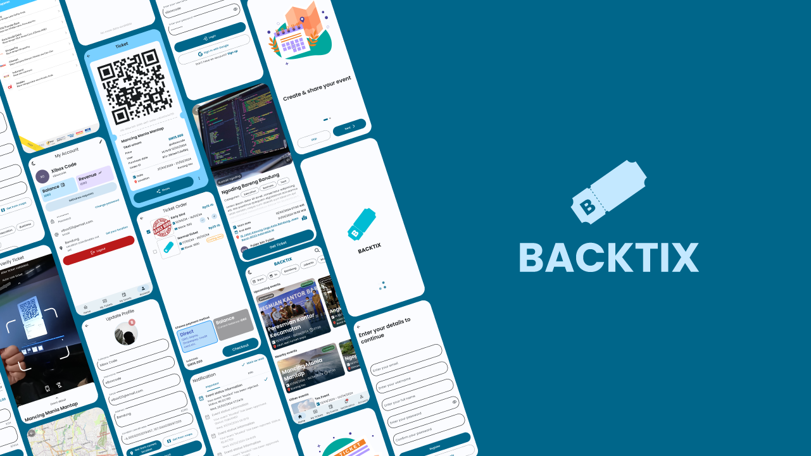

# BackTix

-   [Indonesian](README.md)
-   [English](README.en.md)

This online event creation and ticket sales application is a platform that makes it easy for users to access and participate in various events. Here is a brief description of the app's main features:

-   Authentication:

    The app offers secure authentication via JSON Web Token (JWT) and Google Sign-In. Users can easily log in to their accounts with convenient and secure authentication methods.

-   Account Activation Via Email:

    To increase security and ensure user authenticity, the application requires account activation via email. Users will receive an activation code to confirm and activate their account.

-   Nearby Event Search:

    Users can search for events taking place closest to their location. This feature allows users to discover and participate in events organized around them.

-   Ticket Purchase with Midtrans:

    This application provides online ticket sales services using the Midtrans payment gateway. Users can easily purchase tickets for events of interest with a variety of convenient payment options.

-   Creating an Event with Admin Approval:

    Users who want to hold events can create them through the app. However, the event will be published after getting approval from the admin. This is to ensure the quality and relevance of the events displayed on the platform.

-   Scan QR Code for Event Creator:

    This feature allows event creators to easily verify visitor attendance by scanning the QR code on the ticket. This helps in efficient event management and ticket validation.

-   Withdraw Balance and Income:

    Event creators can withdraw their balance and earnings via the withdrawal feature provided by the application. This gives event organizers the flexibility to manage their financial results with ease.

-   Real-Time Notifications

    With the help of_background service_(Android & IOS), users will receive real-time notifications about event status, withdrawal status, ticket purchases and sales.

## Tech Stack

-   API service / back-end

    -   [NestJS 10](https://nestjs.com/)TypeScript
    -   Prisma ORM
    -   PostgreSQL
    -   Redis
    -   Swagger(API docs)

-   Admin panel web (Monorepo with API service)

    -   [SvelteKit 2](https://kit.svelte.dev/)TypeScript
    -   Flowbite UI component
    -   Tailwind CSS

-   Mobile app

    -   [Flutter 3](https://flutter.dev/)
        -   BLoC
        -   Freezed
        -   Retrofit
        -   fpdart

## Demo and Source Code

## Installation &_How to run_

[Back-end API service](docs/api-service.md)

[Admin-panel](docs/admin-panel.md)

[Mobile app](docs/mobile-app.md)
